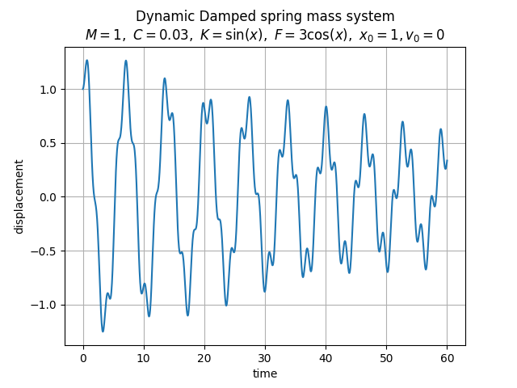

# Mass Spring Damper Solver

An explicit dynamic solver of the damped spring mass system governed by the equation of motion. The acceleration is approximated by the second order central difference scheme and the velocity is approximated by the first order forward differencing scheme.

This repo is only for me to understand explicit solvers and to keep it archived in case I need it in the future :) One more reason to create it publicly is that I was looking if someone else has created the same, and I found some useful ones.

## Sample Solution

