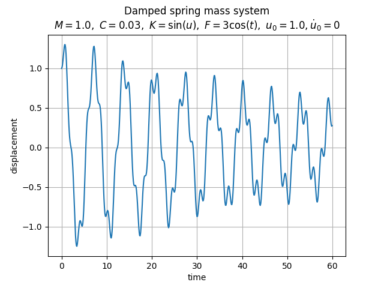
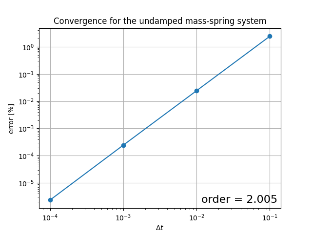

# Mass Spring Damper Solver

An explicit dynamic solver of the damped spring mass system governed by the equation of motion. The acceleration and the middle velocity are approximated by the second order central difference scheme, but the current velocity is approximated by the first order forward differencing scheme. The convergence is second order in case of undamped systems because the current velocity is not added to right hand side (as a damping term), but first order in case of damped systems because of the first order approximation of the velocity. The full documentation and derivation is shown in [Documentation.pdf](Documentation.pdf).

This repo is only for me to understand explicit solvers and to keep it archived in case I need it in the future :) One more reason to create it publicly is that I was looking if someone else has created the same, and I found some useful ones.

## Sample Solution

## Order of Convergence

Undamped|Damped Non-linear
:-:|:-:
|
